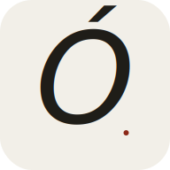
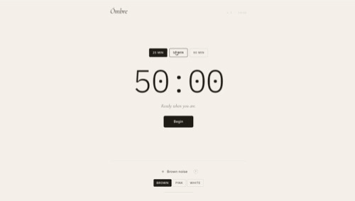

<p align="center">
  
</p>

A deep work environment built for the moment that's slipping out of focus — *the open tab, the half-noticed notification, the room that won't go quiet*. Ómbre runs a Pomodoro timer in the browser, generates continuous brown, pink, or white noise procedurally with the Web Audio API, and gently fades the sound out the second your session ends. No accounts, no audio downloads, no servers — *stay in the shadow*.

## 👤 Author
**Jacqueline**
[Check out my GitHub Profile](https://github.com/jdbostonbu-ops)
🚀 **[Try the Live App](https://jdbostonbu-ops.github.io/ombre/)**

<p align="center">
  
</p>

## 🎨 Brand Identity — Theme & Font Choices

Ómbre's brand is built around one idea: **the screen disappears so the work can come forward**. Every design decision serves that quiet.

### The Pale Stone, Ink Shadow Palette

| Color | Hex | Role |
| :--- | :--- | :--- |
| **Stone** | `#F2EFE8` | Primary background — warm off-white, not glaring white |
| **Ink** | `#1F1D18` | Primary text and structure — body, timer, wordmark |
| **Smoke** | `#5C5852` | Secondary text — soft status lines, supporting labels |
| **Sand** | `#B8AE99` | Tertiary detail — borders, idle state, dividers |
| **Vermillion** | `#8C2818` | The active-session accent — appears *only* during deep work |

The palette breaks the productivity-app convention of cold tech-blue. Most focus apps fight your eyes; Ómbre rests them. The vermillion is a deliberate visual rule: it never appears on idle screens, only when a session is running. **Color is state, not decoration.** When the screen is mostly stone-and-ink, the work isn't happening yet. When the timer turns vermillion, the timer is *alive*. The eye learns to read the screen the way you read a calm room: by what changed.

### Typography — Cormorant Garamond + Inter + IBM Plex Mono

| Typeface | Use | Why |
| :--- | :--- | :--- |
| **Cormorant Garamond** (italic serif) | Wordmark, status lines, modal titles | Editorial weight — the italic *Ómbre* reads like the title page of a notebook, not a productivity app banner |
| **Inter** (400/500/600 sans) | Buttons, preset labels, body UI | Modern, neutral, screen-optimized — handles the utility |
| **IBM Plex Mono** (300/400/500) | Timer numerals, version label | Tabular and monospaced — every digit holds the same width as it ticks down, no layout shift |

Three voices for three jobs: italic serif for the brand and the soft prompts (*"Settle in." / "Stay in the shadow."*), sans for the controls, mono for the data. That contrast is the brand. Wherever you see *Ómbre* in italic Cormorant — favicon, banner, share image — you know it's the same product. **The wordmark is the brand mark.** No icon, no logo lockup; the letters do all the work.

## 🎓 Built During Next Chapter — Phase I

This project was designed and built during **Phase I of Thinking with AI** at Next Chapter Apprenticeship. Each lesson fed directly into this build:

- **Computational Thinking** — Decomposing the project into independent units (timer, noise generator, waveform animator), recognizing the recurring closure-based factory pattern, and abstracting the noise generator into a single factory that handles three different mathematical algorithms (brown / pink / white) without the UI knowing which is which.
- **HTML / CSS / Forms** — Semantic landmark structure, accessible labels with `for` attributes throughout, mobile-first responsive layouts, fluid typography via `clamp()`, color transitions that respect `prefers-reduced-motion`, and a `.modal-backdrop[hidden]` override to prevent the stuck-modal bug carried over from Coyote.
- **JavaScript Fundamentals** — Closure-based factory functions (`createTimer`, `createNoiseGenerator`, `createWaveAnimator`) keeping all state private; `requestAnimationFrame` for accurate countdowns that survive tab backgrounding; `textContent` for every user-rendered string (XSS-safe by construction).
- **Audio Programming** — Reading the Web Audio API spec carefully enough to satisfy mobile autoplay policies (lazy AudioContext on first user gesture, defensive `resume()` calls), and implementing three different noise algorithms from first principles — brown (random walk), pink (Paul Kellet's seven-stage IIR filter cascade), and white (pure random samples) — verified mathematically distinct via roughness analysis.

The project demonstrates everything Phase II covered, deployed as a working PWA.

## 🌐 Browser & Device Compatibility

| Browser / Device | Status | Performance Notes |
| :--- | :--- | :--- |
| **Google Chrome** | ✅ Tested | Full support — timer, all three noise types, smooth crossfading, PWA install. |
| **Microsoft Edge** | ✅ Tested | Matches Chrome rendering and audio engines exactly. |
| **Firefox** | ✅ Tested | Full feature support including Web Audio API and waveform animation. |
| **Apple Safari (macOS)** | ✅ Tested | Lazy AudioContext correctly waits for first user gesture. |
| **iPhone (iOS Safari)** | ✅ Tested | Audio resumes correctly after app foregrounding; vibrates softly on session complete. |
| **iPad / iPadOS** | ✅ Tested | Fluid typography scales correctly across viewport sizes. |

## 🌟 Key Features

- **Three Session Lengths:** 25-minute Pomodoro for short bursts, 50-minute focus for project work, 90-minute deep work for true flow states (Cal Newport's recommended block size). One row of preset buttons; the active one turns vermillion when a session begins.
- **Millisecond-Accurate Timer:** Built around end-timestamp recomputation rather than naive `setInterval` decrement — the timer survives tab backgrounding, system sleep, and long sessions without drift. Uses `requestAnimationFrame` for display ticks.
- **Three Noise Colors:** Brown (deep, smooth, like distant rain), Pink (steady, balanced, like a steady downpour), or White (crisp, masking, like radio static). Brown is the default; switching while playing crossfades smoothly with no clicks or pops.
- **Procedural Audio Generation:** No audio files. The brown-noise random walk, pink-noise IIR cascade, and white-noise samples are computed in your browser at runtime. Each color runs through a low-pass filter calibrated to its character (brown 600 Hz, pink 4000 Hz, white 8000 Hz).
- **Gentle Fade-In and Fade-Out:** All audio uses exponential gain ramps — never an abrupt click on start or stop. When the timer hits zero, noise fades over 2 seconds while the screen returns to its idle state.
- **The Vermillion State Shift:** The body element gets an `is-live` class during active sessions; this single CSS rule coordinates color shifts across the timer numerals, status text, active preset, noise-toggle pip, volume slider thumb, and waveform line — all changing in unison.
- **Breathing Waveform:** When noise is on, a subtle SVG sine path under the toggle gently breathes via `requestAnimationFrame`. Cosmetic confirmation that audio is running, calming enough to ignore.
- **Document Title Updates:** While a session runs, the browser tab title shows time remaining (e.g., *"17:43 · Ómbre"*) — visible across browser tabs without switching back.
- **Keyboard Shortcuts:** Space to begin/pause/resume, R to reset, N to toggle noise, Escape to close any modal — for users who prefer hands stay on the keyboard.
- **Soft End-of-Session Feedback:** When the timer completes, an italic-serif toast appears (*"Session complete."*), the page softly vibrates on supported phones, and the screen returns to its idle stone-and-ink palette.
- **PWA Installable:** Add to Home Screen on iPhone, ⬇ Install on Chrome/Edge desktop. Ómbre becomes a standalone app with no browser chrome — a focus tool that doesn't live inside the distractions it's helping you avoid.
- **Accessible Throughout:** Every label uses `for` attributes, `aria-pressed` toggles correctly, `aria-live` regions announce timer changes to screen readers, every animation respects `@media (prefers-reduced-motion)`.

## 🔒 Privacy & Your Data

Ómbre was built to know nothing about you, period.

- **No account, no signup.** You can run sessions, generate noise, and use the timer without creating an account or sharing personal information.
- **No persistence.** Ómbre doesn't even use `localStorage` — every session starts fresh. There is no progress to track, no history to log, no data to leak.
- **No server, anywhere.** Ómbre has no backend, no database, no API. It's a static site. Once your browser loads it, nothing else gets sent over the network.
- **No audio files downloaded.** All three noise types are generated mathematically in your browser at runtime. No CDN calls for sound assets, no streaming, no audio licenses.
- **No notifications, no permissions.** Unlike most timer apps, Ómbre doesn't ask for notification permission. The app asks for nothing. The toast and the optional phone vibration are the only end-of-session signals — both happen entirely on your device.

Ómbre doesn't use cookies, doesn't track you, and doesn't have a database that stores anything about you.

## 🛠️ Tech Stack

- **Frontend:** Vanilla JavaScript (ES6+) — closure-based factory functions, `requestAnimationFrame` for both the timer and the waveform, the Web Audio API for procedural sound generation, `crypto.randomUUID()` patterns reused from Coyote
- **Styling:** CSS3 — Custom Properties, CSS Grid, Flexbox, `@keyframes` for the waveform breath, `clamp()` for fluid timer numerals (`clamp(4.5rem, 18vw, 8rem)`), mobile-first responsive design with breakpoints at 480px and 600px
- **Typography:** Cormorant Garamond, Inter, IBM Plex Mono — Google Fonts
- **Audio:** Web Audio API — `AudioContext`, `AudioBufferSourceNode`, `BiquadFilterNode` (low-pass), `GainNode` for fades and volume; lazy context creation to satisfy iOS Safari and Chrome mobile autoplay policies
- **Noise Algorithms:**
  - **Brown:** Brownian random walk — `last = last * 0.97 + (Math.random() - 0.5) * 0.05` — the leak factor (0.97) prevents DC drift across long sessions
  - **Pink:** Paul Kellet's seven-stage IIR filter cascade producing a -3 dB/octave roll-off
  - **White:** Pure random samples — `(Math.random() * 2 - 1) * 0.4`
- **PWA:** Web App Manifest with theme color, service worker (`sw.js`) using network-first strategy with offline fallback, full Add-to-Home-Screen support
- **Deployment:** GitHub Pages — static site, automatic HTTPS, auto-deploy on every push to `main`

## 🚀 The User Flow

- **Land on the screen** → see the italic *Ómbre* wordmark in the top-left, three duration presets centered, the timer reading `25:00`, and the soft prompt: *"Settle in."*
- **Pick a duration** → 25, 50, or 90 minutes; the timer updates, presets stay visible while idle
- **Click "Begin"** → the body shifts: timer numerals turn vermillion, status changes to *"Stay in the shadow."*, presets hide so the screen quiets, primary button becomes "Pause," secondary appears as "Reset"
- **Optionally toggle Brown noise** → click the noise pip; fade-in over 800ms; the waveform under the toggle gently begins to breathe; volume slider appears
- **Optionally pick a different color** → tap Pink or White; the playing audio crossfades to the new type smoothly, with no gap or pop
- **Adjust volume** → slider appears below the waveform; smooth gain ramping prevents clicks
- **Pause if needed** → spacebar or tap; the vermillion fades back to ink; status changes to *"Holding your place."*
- **Timer hits zero** → noise fades out over 2 seconds; status becomes *"A session well kept."*; phone vibrates softly on supported devices; primary button changes to "Again," secondary to "Done"
- **Choose your next move** → start another session, or return to idle and pick a different duration

## 🎼 The Brown Noise Algorithm — How It Works

Ómbre's audio engine is the engineering heart of the project. **No audio file is ever downloaded.** All three noise types are computed in your browser, sample by sample, when you click the toggle.

### Brown Noise — A Random Walk With a Leak

True brown noise (also called Brownian noise, or red noise) is the *integral of white noise* — each sample equals the previous sample plus a small random delta. The math is the same as the Brownian motion that physicist Robert Brown observed when watching pollen drift through liquid: a smooth, unpredictable path that stays loosely centered without ever settling.

```js
let last = 0;
for (let i = 0; i < length; i++) {
    last = last * 0.97 + (Math.random() - 0.5) * 0.05;
    data[i] = last * 3.5;
}
```

The `0.97` multiplier is a *leak factor* — without it, the random walk would slowly drift past the speaker's amplitude range and clip badly across a long session. The `0.05` random delta is small enough that consecutive samples are nearly identical, which is what makes the sound smooth rather than rough. The final `* 3.5` scales the signal back up to a healthy listening level after the leak attenuates it.

### Pink Noise — Paul Kellet's IIR Cascade

Pink noise rolls off at -3 dB/octave (compared to brown's -6 dB/octave), so it sounds steadier and slightly brighter than brown. Ómbre uses Paul Kellet's classic seven-stage IIR filter cascade — a textbook DSP solution that's been the standard for procedural pink noise generation since the 1990s. White noise feeds into a chain of seven first-order filters with carefully tuned coefficients; the output is summed.

### White Noise — The Simplest Case

```js
data[i] = (Math.random() * 2 - 1) * 0.4;
```

Each sample is independent of the last. White noise's flat power spectrum is the harshest of the three to listen to, so Ómbre runs it through a low-pass filter at 8 kHz to soften the highest frequencies — keeping its character intact while reducing listener fatigue.

### The Low-Pass Filter — Calibrated Per Color

Each noise type runs through a `BiquadFilterNode` low-pass at a different cutoff:

- **Brown** at 600 Hz — keeps only the deep rumble; sounds like a distant waterfall
- **Pink** at 4000 Hz — preserves more midrange; sounds like steady rainfall
- **White** at 8000 Hz — light filtering, retains crispness without the hiss

This is what keeps the three colors feeling balanced in volume rather than each one being shockingly different in loudness when you switch.

### Smooth Crossfading Between Colors

Switching noise types while playing doesn't restart the audio — Ómbre fades the old source out over 250 ms while building a new buffer for the chosen type, then fades the new source in over 400 ms. The user hears one smooth transition instead of *click — pause — click*.

### Mobile Autoplay Policies

iOS Safari and Chrome mobile won't let an `AudioContext` produce sound until the user has tapped something. Ómbre creates the AudioContext **lazily**, on the first toggle click — which is itself the user gesture the browser requires. On every subsequent `play()`, the code defensively calls `ctx.resume()` in case the OS suspended the context (tab backgrounded, screen locked, app switched).

The result: audio that just works on phone, tablet, laptop — without permission dialogs, without errors, without the "tap to enable sound" friction every other audio web app shows.

If you installed Ómbre to the home screen earlier today and we've shipped changes since, your home-screen version might be cached. Do this dance:

1. Long-press the Ómbre icon on your home screen
2. Tap Remove App → Delete from Home Screen
3. Open Safari, visit your Ómbre URL fresh
4. Pull down to refresh the page
5. Tap Share → Add to Home Screen → Add
6. Open the fresh icon — try the noise toggle immediately

## 🔐 Architecture Overview

```
Browser (everything happens here)
  ↓ User clicks Begin / toggles noise / changes session length
Closure-based factories
  ↓ createTimer({onTick, onComplete})
  ↓   - Private state: duration, end-timestamp, paused state, rAF handle
  ↓   - Public API: start, pause, resume, reset, setDuration, getState
  ↓ createNoiseGenerator()
  ↓   - Private state: AudioContext, gain node, filter, source, type, volume
  ↓   - Public API: play, stop, fadeOut, setVolume, setType, getType, isPlaying
  ↓ createWaveAnimator(pathEl)
  ↓   - Private state: rAF handle, phase
  ↓   - Public API: start, stop
Render layer
  ↓ Body class swaps (.is-live / .is-done) coordinate vermillion accent
  ↓ across timer, status, active preset, noise pip, slider thumb
Web Audio Graph
  ↓ AudioBufferSourceNode (loops a 4-second procedurally-generated buffer)
  ↓ → BiquadFilterNode (low-pass, calibrated per noise color)
  ↓ → GainNode (handles fades and volume ramping)
  ↓ → destination (your speakers)
```

The whole app is **three factory functions** wired together by an `init()` function that handles DOM events. State stays private, the UI subscribes to changes, and every audio change is gain-ramped to prevent clicks.

## 🎓 Future Vision

- **Session History (Optional):** A pure-local opt-in counter showing how many minutes the user has spent in deep work this week — no account, no server, just a number that lives in `localStorage`.
- **Custom Session Lengths:** Allow users to pick any duration in 5-minute increments alongside the three presets.
- **Ambient Field Recordings:** Real-world ambient sounds (a quiet library, a coffee shop, a rainstorm) as an alternative to the three procedural noise colors — generated procedurally rather than streamed from a server.
- **End-of-Session Chime:** An optional soft tone at session end for users who want an audible signal alongside the screen change.
- **Block Scheduler:** A "stack" of back-to-back sessions with short breaks between them, for users running real Pomodoro cycles (4 × 25-min work + 5-min break + one long break).
- **Binaural Beats Mode:** A research-mode option for users curious about whether stereo frequency offsets affect their focus — clearly framed as experimental, not therapeutic.

## 🧰 Run It Locally

If you want to run a local copy for development:

```bash
# Clone the repo
git clone <your-repo-url>
cd ombre

# Serve as a static site — any of these work:
python3 -m http.server 8000
# OR with VS Code's Live Server extension
# OR with any static file server you prefer

# Open http://localhost:8000 in your browser
```

There's no build step, no `npm install`, no backend to run. Ómbre is plain HTML, CSS, and JavaScript — open the folder, serve it, you're running it. PWA features (service worker, install button) require HTTPS or localhost, both of which the above setup satisfies.

## 🎓 Phase I

Ómbre is what I built during Phase I of Thinking with AI — a single, focused tool that solves one real problem (the room that won't go quiet) using only the browser, with no backend, no API key, no account, no audio files, and a procedural audio engine that generates every sample of brown, pink, and white noise from first principles.

⭐ Love this project? Give it a star and explore the other deployed projects in this portfolio.

<p align="center">
  
</p>